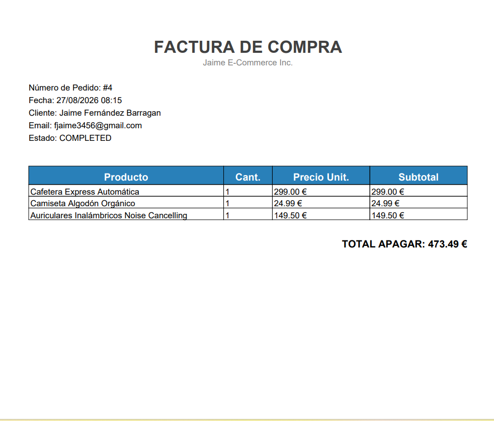

# ⚙️ E-Commerce REST API - Backend

API RESTful transaccional desarrollada con **Spring Boot** que gestiona la lógica de negocio, autenticación segura, inventario y procesamiento de facturas en PDF enviadas vía email.

---

## 📸 Demostración y Flujo de Trabajo

| Autenticación Segura (JWT) | Correo Transaccional Recibido |
| :---: | :---: |
|  |  |

| Factura PDF Generada en Memoria |
| :---: |
|  |

---

## 🚀 Funcionalidades Clave

- **Seguridad Stateless:** Autenticación y autorización basada en **JWT (JSON Web Tokens)** con cifrado de contraseñas mediante `BCryptPasswordEncoder`.
- **Transacciones Atómicas:** Procesamiento seguro de órdenes con `@Transactional` garantizando la consistencia del stock y el estado de los pedidos.
- **Generación de PDF en Memoria:** Creación de facturas dinámicas en formato PDF desde un `ByteArrayInputStream` evitando almacenamiento innecesario en disco.
- **Servicio Mail SMTP:** Envío automático e ininterrumpido de correos electrónicos transaccionales mediante `JavaMailSender` tras cada compra exitosa.

---

## 🛠️ Tecnologías Utilizadas

- **Framework:** Spring Boot 3 / Java 17
- **Seguridad:** Spring Security & JJWT
- **Persistencia:** Spring Data JPA & Hibernate
- **Email & Documentos:** JavaMailSender (SMTP Gmail) & OpenPDF / iText
- **Base de Datos:** MySQL / PostgreSQL

---
